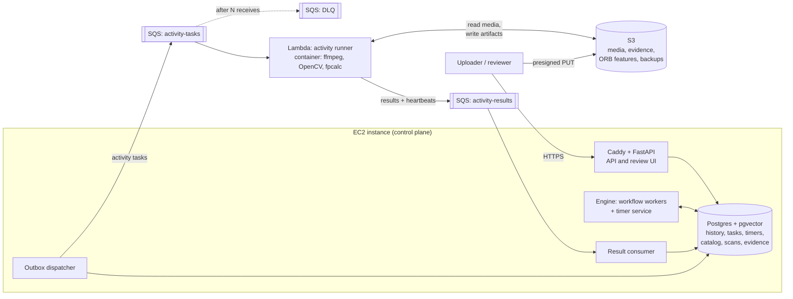
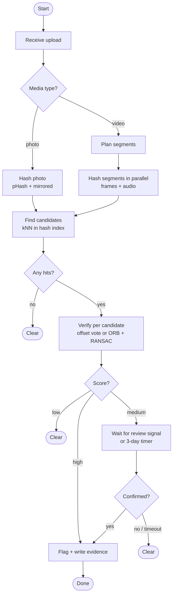

# Media infringement detection: design and learning plan

A system that detects when someone republishes photos or videos whose rights you sell. It fingerprints your catalog, checks suspect media against it, and routes uncertain matches to a human reviewer. It runs on a home-built durable execution engine, and it is deployed on AWS within the Free Plan credits.

This document is both the system design and a 14-week learning plan. The design sections say *what* to build and *why*; the plan says *in what order* and *what you should have learned by the end of each phase*.

---

## 1. Goals

**Product goals**

- Given a suspect photo or video, decide whether it reuses media from the catalog, and if so which original and which part of it.
- Survive common evasion tricks: re-encoding, resizing, letterboxing, mirroring, colour shifts, cropping, overlays, short clips.
- Produce reviewable evidence: matched frames, timestamps, scores.
- Keep a human in the loop for uncertain cases.

**Learning goals**

| Area | What you should be able to explain and defend afterwards |
|---|---|
| Media fingerprinting | Why perceptual hashes survive re-encoding, why they fail on crops, and how local features fix that |
| Evaluation | Precision, recall, threshold selection from labeled data |
| Similarity search | Hamming-space search, HNSW vs multi-index hashing, recall vs latency |
| Durable execution | Event-sourced history, deterministic replay, timers, signals, fencing |
| Distributed messaging | Outbox pattern, at-least-once delivery, idempotency, who owns retries |
| Cloud on a budget | Serverless vs always-on compute, cost traps, least-privilege IAM, IaC |
| Operations | Load testing, chaos testing, finding the real bottleneck |

**Non-goals**

- Web crawling to *find* suspect media. Suspects are submitted (uploaded or given as a URL you fetch manually).
- Legal decisions. The system produces evidence; whether to send a takedown is a human and legal decision.
- Speed-change, rotation and picture-in-picture robustness in v1 (measured, but not required to pass).

---

## 2. Requirements

### Functional

1. **Ingest an original** (photo or video): store it, fingerprint it, index the fingerprints.
2. **Scan a suspect**: fingerprint it, find candidate originals, verify, score.
3. **Verdict routing**: high score → flag; low score → clear; medium → human review.
4. **Human review**: side-by-side evidence; approve or reject; auto-resolve after a timeout.
5. **Evidence record** for every flag: which original, offsets, matched frames, scores, reviewer.
6. **Status API**: query any scan's state and result.

### Non-functional (learning scale, but taken seriously)

| Property | Target |
|---|---|
| Catalog size | Up to 1,000 videos (avg 5 min) and 5,000 photos |
| Scan throughput | Sustain 1,000 suspect scans/day; burst of 5,000 during load tests |
| Scan latency | p95 under 2 min for a 5-minute suspect video; under 10 s for a photo |
| Durability | No accepted scan is ever lost, even if any process dies at any point |
| Exactly-once *effects* | No duplicate evidence records or duplicate flags, even under retries |
| Detection quality | Targets in section 10, measured on the attack dataset |
| Cost | Under ~$20/month while running; $0 when torn down |

### Constraints

- Python.
- AWS account on the **Free Plan** (accounts created on or after 15 July 2025). The facts that shape this design, as of September 2026:
  - New accounts get $100 in credits at signup, plus up to $100 more for completing onboarding activities (EC2, RDS, Lambda, Bedrock, Budgets).
  - The Free Plan ends after **6 months or when credits run out**, whichever comes first. The account is then closed unless you upgrade to the Paid Plan, and resources are deleted after a grace period.
  - "Always free" monthly allowances continue regardless of credits. The ones this design leans on: Lambda (1M requests, 400,000 GB-seconds), SQS (1M requests), SNS, CloudWatch basics, CloudFront. Everything else (EC2, EBS, public IPv4, S3 beyond any allowance, RDS) draws down credits.
  - Accounts created *before* 15 July 2025 are on the legacy 12-month free tier instead, which changes the maths in section 7.
  - **Verify on the AWS Free Tier page before you start.** Allowances change.
- Consequence: **the 6-month clock starts at account creation**, so all early phases run locally and the AWS account is created only when the cloud phase begins (week 10).

---

## 3. Assumptions and load estimation

Rough numbers to make design decisions with. Replace them with measurements as you go.

**Catalog index size**

- 1,000 videos × 5 min × 60 s × 2 fps = **600,000 frame hashes**.
- Per row: 8-byte hash + ids + timestamp + tuple overhead ≈ 60 bytes → ~36 MB of table, plus an HNSW index of similar or larger size. Fits in RAM on a 2 GB instance.
- 5,000 photos: pHash rows are negligible; ORB descriptors (~500 × 32 bytes ≈ 16 KB each) ≈ 80 MB, stored in S3, not Postgres.
- Audio fingerprints: roughly 8 32-bit values per second → 1,000 videos × 300 s × 8 × 4 bytes ≈ 10 MB.

**Scan compute**

- Decoding and hashing a 5-minute 1080p video at 2 fps: estimate 20–40 s of single-core CPU. Measure this in phase 2; it drives everything below.
- On Lambda with 2 GB memory: 2 GB × 30 s = 60 GB-s per scan. The always-free 400,000 GB-s/month covers roughly **6,000 full-length scans a month**, or far more short clips.
- Candidate lookup: a 5-minute suspect has 600 frames → 600 kNN queries at ~1 ms each → under a second. Not the bottleneck.

**Storage**

- Test catalog in S3: keep it to a few GB (short originals, compressed). Suspect uploads get a lifecycle rule and expire after 7 days.

**Conclusion:** the expensive part is media decoding, which is bursty and embarrassingly parallel, so it belongs on Lambda. The control plane is small and steady, so it belongs on one small always-on instance.

---
## 4. High-level architecture



| Component | Runs on | Responsibility |
|---|---|---|
| API + review UI | EC2 (FastAPI, HTMX, behind Caddy for TLS) | Presigned uploads, start scans, status, review decisions (sent as workflow signals) |
| Workflow workers | EC2 | Replay workflow code, emit commands, commit history |
| Timer service | EC2 | Fire due timers (review timeouts, retry backoff) |
| Outbox dispatcher | EC2 | Move committed activity tasks from Postgres to SQS |
| Result consumer | EC2 | Apply activity results and heartbeats to Postgres, rejecting stale attempts |
| Activity runner | Lambda (container image) | All media work: probe, sample, hash, fingerprint audio, ORB, evidence thumbnails |
| Postgres + pgvector | EC2 (Docker) | Single source of truth: engine state and domain data |
| S3 | Managed | All binary data: originals, suspects, derived artifacts, evidence, `pg_dump` backups |

**The key boundary:** Lambda never talks to Postgres. It receives everything it needs in the task message, reads and writes S3, and reports back through a queue. This keeps Lambda out of the VPC, which avoids a NAT Gateway (~$32/month) and VPC endpoints, and it means the EC2 instance needs no inbound access from Lambda at all.

---

## 5. Workflows

Two workflow types run on the engine.

### 5.1 `ingest_original`

```python
@workflow
async def ingest_original(ctx, original_id, kind):
    meta = await ctx.activity(probe, original_id)
    if kind == "photo":
        await ctx.activity(fingerprint_photo, original_id)          # pHash + ORB features -> S3
    else:
        segments = plan_segments(meta.duration, seconds=60)          # deterministic, pure
        await ctx.gather(*[ctx.activity(hash_segment, original_id, s) for s in segments])
        await ctx.activity(fingerprint_audio, original_id)
    await ctx.activity(index_original, original_id)                 # rows into pgvector
```

### 5.2 `scan_suspect`



```python
@workflow
async def scan_suspect(ctx, scan_id, kind):
    fp = await ctx.activity(fingerprint_suspect, scan_id, kind)     # returns S3 key, not data
    candidates = await ctx.activity(find_candidates, scan_id, fp)
    if not candidates:
        return await ctx.activity(set_verdict, scan_id, "clear")

    results = await ctx.gather(*[ctx.activity(verify, scan_id, c) for c in candidates])
    best = max(results, key=lambda r: r.score)

    if best.score >= ctx.config.high:
        await ctx.activity(flag, scan_id, best)
    elif best.score < ctx.config.low:
        await ctx.activity(set_verdict, scan_id, "clear")
    else:
        await ctx.activity(request_review, scan_id, best)
        decision = await ctx.wait_signal("review", timeout=timedelta(days=3))
        if decision and decision.approved:
            await ctx.activity(flag, scan_id, best, reviewer=decision.reviewer)
        else:
            await ctx.activity(set_verdict, scan_id, "clear")
```

Note that `find_candidates`, `set_verdict` and `flag` touch Postgres, so they are **local activities**: executed by the workflow worker on EC2, not dispatched to Lambda. The engine needs a routing field per activity (`queue = "local" | "lambda"`). This is a useful feature to design explicitly.

`ctx.config` is read once at workflow start and recorded in history, so changing thresholds later never makes running workflows replay differently.

---

## 6. Deep dives

### 6.1 Fingerprinting

**Video frames.** Sample at 2 fps, convert to grayscale, crop black bars using one crop box per video (computed from the brightest pixel at each position across all samples, so dark scenes don't cause bad crops), then compute a 64-bit DCT pHash. Suspects are also hashed mirrored; originals are hashed once.

**Segmenting long videos.** Each `hash_segment` activity handles 60 seconds. Lambda passes a presigned S3 URL straight to ffmpeg (`ffmpeg -ss 120 -t 60 -i "<url>" ...`), which uses HTTP range requests, so a segment never downloads the whole file. This requires the MP4 index at the start of the file; the `probe` activity checks this and, if needed, rewrites the file once with `-movflags +faststart`. Segmenting keeps each invocation far below Lambda's 15-minute limit and gives you dynamic fan-out to exercise in the engine.

**Audio.** `fpcalc -raw` (Chromaprint) produces a sequence of 32-bit values; compare two sequences by counting differing bits at each alignment, and reuse the same offset voting as video. Audio survives mirroring, cropping and overlays, which are the main weaknesses of frame hashing.

**Photos.** pHash (plus mirrored) for the fast index; ORB keypoints and descriptors computed at ingest and stored in S3 as `.npz`, so verification never recomputes the original's features.

**Rule: pointers, not payloads.** Activities return S3 keys and small summaries. Frame hashes for a suspect are written to S3 as a compact array; history stores only the key. A 5-minute video's hashes are ~5 KB, but the principle matters more than the size.

### 6.2 Candidate search and verification

**Search.** Hashes are stored as `bit(64)` in pgvector with an HNSW index using `bit_hamming_ops`. For each suspect frame, fetch its k nearest catalog frames (`ORDER BY phash <~> $1 LIMIT 10`) and keep those within the distance threshold. Group all hits by original and keep the top few originals by hit count as candidates.

**Video verification** (per candidate): for every hit, compute `offset = original_t - suspect_t` and vote. Real reuse concentrates votes on one offset; coincidental similarity scatters them. The score combines the fraction of suspect frames that align, the mean Hamming distance of aligned pairs, and whether audio agrees at the same offset.

**Photo verification:** match ORB descriptors (Hamming distance, ratio test), estimate a homography with RANSAC, and score by the number of geometric inliers. The homography also gives you the crop region, which becomes evidence.

**Why two stages:** kNN over hashes is cheap but noisy; verification is precise but expensive. The same pattern appears in search engines, deduplication and recommendation systems.

### 6.3 Scoring bands

- `score ≥ high` → flag automatically. Chosen so the false-positive rate on the negative set is effectively zero.
- `score < low` → clear automatically. Chosen so almost no true infringements fall below it.
- In between → human review. The width of this band is a product decision: wider means fewer mistakes and more reviewer work.

Thresholds come from data (phase 5), live in config, and are recorded in each workflow's history at start.

### 6.4 Data model

Engine tables (`workflows`, `history`, `tasks`, `timers`) follow the engine design. Domain tables:

```sql
CREATE EXTENSION IF NOT EXISTS vector;

CREATE TABLE originals (
    id          uuid PRIMARY KEY,
    kind        text NOT NULL CHECK (kind IN ('video', 'photo')),
    title       text NOT NULL,
    s3_key      text NOT NULL,
    duration_ms int,
    status      text NOT NULL DEFAULT 'ingesting',   -- ingesting | indexed | failed
    created_at  timestamptz NOT NULL DEFAULT now()
);

CREATE TABLE original_frames (
    original_id uuid NOT NULL REFERENCES originals(id) ON DELETE CASCADE,
    t_ms        int  NOT NULL,
    phash       bit(64) NOT NULL,
    PRIMARY KEY (original_id, t_ms)
);
CREATE INDEX ON original_frames USING hnsw (phash bit_hamming_ops);

CREATE TABLE original_photos (
    original_id uuid PRIMARY KEY REFERENCES originals(id) ON DELETE CASCADE,
    phash       bit(64) NOT NULL,
    orb_s3_key  text NOT NULL
);
CREATE INDEX ON original_photos USING hnsw (phash bit_hamming_ops);

CREATE TABLE original_audio (
    original_id uuid PRIMARY KEY REFERENCES originals(id) ON DELETE CASCADE,
    fp_s3_key   text NOT NULL
);

CREATE TABLE scans (
    id          uuid PRIMARY KEY,
    kind        text NOT NULL,
    s3_key      text NOT NULL,
    source_url  text,
    workflow_id uuid NOT NULL UNIQUE,
    verdict     text,                               -- null | clear | flagged
    created_at  timestamptz NOT NULL DEFAULT now()
);

CREATE TABLE evidence (
    id              uuid PRIMARY KEY,
    scan_id         uuid NOT NULL REFERENCES scans(id),
    original_id     uuid NOT NULL REFERENCES originals(id),
    score           real NOT NULL,
    offset_ms       int,
    details         jsonb NOT NULL,                  -- matched frames, S3 thumbnail keys, homography
    reviewer        text,
    idempotency_key text NOT NULL UNIQUE,            -- "{workflow_id}:{seq}"
    created_at      timestamptz NOT NULL DEFAULT now()
);
```

The `UNIQUE` on `evidence.idempotency_key` is what makes the `flag` activity safe to retry: a second attempt hits the constraint and returns the existing row instead of creating a duplicate.

### 6.5 API

| Method and path | Purpose |
|---|---|
| `POST /v1/originals` | Create an original; returns id and presigned upload URL |
| `POST /v1/originals/{id}/ingest` | Start `ingest_original` (idempotent: returns the existing workflow if already started) |
| `POST /v1/scans` | Create a scan; returns id and presigned upload URL |
| `POST /v1/scans/{id}/start` | Start `scan_suspect` |
| `GET /v1/scans/{id}` | Status, verdict, best match, evidence links |
| `GET /review` | Review queue (HTMX page) |
| `POST /v1/scans/{id}/review` | Body `{approved, reviewer}`; sent to the workflow as the `review` signal |

Uploads go straight from the client to S3 via presigned URLs, so large files never pass through the EC2 instance.

### 6.6 Activity dispatch over SQS

This is the most instructive part of the AWS design, because it is where a database, a queue and a serverless function have to agree.

**The dual-write problem.** The workflow worker commits "activity scheduled" to Postgres. If it also sent to SQS directly, a crash between the two would either lose the task (commit, no send) or send a task that doesn't exist (send, rollback). Solution: the **transactional outbox**. The worker only writes the task row. A separate dispatcher polls for undispatched rows (`FOR UPDATE SKIP LOCKED`), sends them to SQS, and marks them dispatched. A crash between send and mark causes a duplicate send, never a loss, so everything downstream must tolerate duplicates.

**The message** carries `task_id`, `attempt`, activity name, arguments (small, or S3 keys), and a deadline.

**Result path.** Lambda sends `{task_id, attempt, status, result}` to `activity-results`. The result consumer applies it only if `attempt` matches the task's current attempt (the fencing check). Stale or duplicate results are acknowledged and dropped.

**Who owns retries.** Two layers could retry: SQS redelivery and the engine. Decide explicitly:

- The **engine** owns activity retries and backoff. Lambda catches every exception and reports `status = failed`; the engine schedules the next attempt with a new attempt number.
- **SQS redelivery** covers only infrastructure failure (Lambda crashed or timed out before reporting). The engine also has a lease: if no result or heartbeat arrives before the deadline, it schedules a new attempt itself.
- The DLQ (`maxReceiveCount` around 3) catches poison messages so they stop looping; an alarm on DLQ depth tells you something is wrong.

**Heartbeats.** Long activities send `{task_id, attempt, type: heartbeat, progress}` to the results queue every ~15 s. The consumer extends the lease. A dead Lambda is then detected within seconds rather than at the activity deadline.

**SQS settings.** Standard queue; visibility timeout at least 6× the Lambda timeout (AWS's recommendation for event source mappings); partial batch responses enabled; `maximum concurrency` on the event source mapping as your backpressure knob.

### 6.7 Failure handling

| Failure | What happens | Why nothing is lost or duplicated |
|---|---|---|
| Workflow worker dies mid-replay | Task lease expires; another worker replays | Commits are atomic; unique `(workflow_id, seq)` rejects the zombie's late commit |
| Dispatcher dies after SQS send, before marking | Task sent twice | Result consumer accepts one result per attempt |
| Lambda crashes mid-activity | SQS redelivers after visibility timeout, or engine lease expires | Activities are idempotent; results are fenced by attempt |
| Lambda succeeds, result message lost | Engine lease expires; new attempt runs | Idempotent activity; `flag` protected by unique idempotency key |
| Poison message (corrupt video) | Fails repeatedly, lands in DLQ; engine marks activity failed after max attempts | Workflow decides: mark scan `failed`, not stuck |
| EC2 instance lost | Control plane down; SQS buffers tasks and results | Restore Postgres from nightly `pg_dump` in S3; accept up to 24 h data loss (a known v1 limitation) |
| Reviewer never responds | Review timer fires after 3 days | Workflow resolves to `clear` and records why |

### 6.8 Security

- **IAM least privilege.** The Lambda role can read `media/` and write `derived/` and `evidence/` in S3, receive from `activity-tasks`, send to `activity-results`, and nothing else. The EC2 role can send and receive on the two queues, read and write S3, and read its SSM parameters.
- **Secrets** in SSM Parameter Store (standard parameters are free), not in environment files.
- **No public database.** The security group allows only 80/443 from anywhere (and 22 from your IP, or better, use SSM Session Manager and close 22 entirely).
- **Presigned URLs** expire in minutes and are scoped to one key.
- **Review UI auth:** Caddy `basic_auth` is enough for a single-user project.
- **Root account:** MFA on, never used day-to-day.

### 6.9 Observability

- Structured JSON logs with `workflow_id`, `task_id`, `attempt` on every line, so one scan can be traced across EC2 and Lambda.
- CloudWatch Logs with a **7-day retention** set on every log group (the default is forever, and ingestion is billed).
- Metrics worth having: scans started/completed per verdict, end-to-end scan latency, activity latency by type, SQS queue depth and age of oldest message, DLQ depth, Lambda errors and throttles, review queue size.
- Alarms: DLQ depth > 0, oldest message age > 5 min, Lambda throttles > 0.

---
## 7. AWS deployment and cost

### 7.1 Local first, cloud later

Every component has a local stand-in, so phases 1–9 cost nothing and don't start the Free Plan clock:

| AWS | Local (docker compose) |
|---|---|
| EC2 + Postgres | `pgvector/pgvector:pg17` container |
| S3 | SeaweedFS (S3-compatible API) |
| SQS | ElasticMQ (SQS-compatible API) |
| Lambda | The same handler function, run by a local worker process polling ElasticMQ |

All AWS clients take an `endpoint_url` from config, so the same code runs in both places. The Lambda handler is a thin wrapper: `handler(event) -> for record in event["Records"]: run_activity(json.loads(record["body"]))`.

### 7.2 Monthly cost estimate while deployed

Approximate on-demand prices; eu-central-1 (Frankfurt, closest to Romania) is roughly 10–15% dearer than us-east-1. Check the AWS Pricing Calculator for your region.

| Item | Estimate | Notes |
|---|---|---|
| EC2 `t4g.small` (2 GB, Graviton), 24/7 | ~$12 | `t4g.micro` (1 GB) is ~$6 and workable with swap, since media work runs on Lambda |
| EBS gp3, 20 GB | ~$1.60 | |
| Public IPv4 address | ~$3.65 | $0.005/hour for every public IPv4, attached or not |
| S3, ~10 GB + requests | ~$0.50 | Lifecycle rules expire suspects and old backups |
| ECR, ~1 GB image | ~$0.10 | |
| CloudWatch Logs | ~$1 | Only with 7-day retention set |
| Lambda, SQS, SNS | $0 | Within always-free allowances at this scale |
| **Total** | **~$19/month** | **~$13 with `t4g.micro`** |

Stopping the instance when you're not working removes most of the EC2 cost (EBS is still billed). Four months of cloud use at 24/7 costs roughly $75, well inside the credits.

### 7.3 Cost traps to avoid in this design

- **NAT Gateway** (~$32/month plus data): not needed, because Lambda runs outside the VPC and EC2 sits in a public subnet.
- **Application Load Balancer** (~$16+/month): Caddy on the instance terminates TLS instead.
- **Interface VPC endpoints** (~$7+/month each): not needed for the same reason as NAT.
- **CloudWatch log groups without retention**: set 7 days on every group, including the ones Lambda creates.
- **Recursive Lambda triggers**: never trigger Lambda from S3 events on a prefix that Lambda writes to. This design triggers from SQS only.
- **Leftovers after teardown**: EBS snapshots, unattached volumes, Elastic IPs, versioned S3 objects, ECR images.
- **Lambda concurrency quota**: new accounts can have a low concurrent-execution quota. Check it in Service Quotas in week 11 and request an increase well before the load test.

### 7.4 Infrastructure as code

Use Terraform: the more portable skill, since it works the same way across clouds. IAM grants are more verbose than CDK constructs, which makes least privilege explicit. Never create resources by clicking in the console, so `terraform destroy` really removes everything. The Lambda container image is built and pushed to ECR outside Terraform (a `just` recipe); Terraform only references its tag.

---

## 8. Trade-offs

| Decision | Chosen | Alternative | Why, and when to switch |
|---|---|---|---|
| Workflow orchestration | Own durable engine on Postgres | AWS Step Functions | Building it is the learning goal. Rewriting one workflow in Step Functions afterwards is a worthwhile comparison exercise |
| Media compute | Lambda (container image) | ECS on Fargate, or EC2 workers | Bursty, parallel, and free at this scale. Switch if activities regularly need over 15 min or a GPU |
| Database | Postgres in Docker on EC2 | RDS or Aurora Serverless | Cheapest and teaches more ops. Switch to managed when data loss of up to 24 h stops being acceptable |
| Hash search | pgvector HNSW | Hand-built multi-index hashing; a vector database | One system to run. MIH is built anyway in phase 4 for comparison |
| Task transport | SQS + outbox | Lambda polling Postgres directly | Keeps Lambda out of the VPC, adds backpressure and a DLQ. Costs the outbox complexity, which is itself a lesson |
| Frame sampling | Fixed 2 fps | Scene-change keyframes | Simple and predictable. Keyframes cut cost but make offset voting harder |
| Availability | Single instance | Multi-AZ | Fine for learning; explicitly listed as a limitation |

---

## 9. Learning plan (14 weeks, ~6–8 h/week)

Each phase ends with something runnable and a measurable "done when". If a phase overruns, trim rather than slip: audio, the hand-built MIH, and the review UI (a CLI works) can be cut without breaking the project.

| Weeks | Phase | Where | You end up with |
|---|---|---|---|
| 1 | Foundation and attack generator | Local | Repo, compose stack, labeled dataset |
| 2–3 | Matching core | Local | Photo and video matchers with measured accuracy |
| 4 | Audio fingerprinting | Local | Second signal that survives visual tricks |
| 5–6 | Catalog index | Local | Fast near-match search, benchmarked |
| 7 | Scoring and thresholds | Local | Data-driven bands |
| 8–10 | Durable engine | Local | Both workflows running end to end |
| 11 | AWS deployment | AWS | The system live, deployed from code |
| 12 | Review and evidence | AWS | Reviewer UI sending signals |
| 13 | Load and chaos testing | AWS | Bottleneck analysis, correctness proof |
| 14 | Write-up and wrap-up | AWS → none | Portfolio README, teardown decision |

### Week 1: foundation and attack generator

**Build.** Repo with uv, pytest, ruff, a `justfile`; `docker-compose.yml` with Postgres + pgvector, SeaweedFS and ElasticMQ. Collect originals: clips from Blender's open movies (Big Buck Bunny, Sintel, Tears of Steel; Creative Commons) and a few dozen of your own photos. Write the attack generator: for each original, 15–20 variants (recompression, resize, letterbox, mirror, crops at 10/20/35%, brightness and contrast, text and logo overlays, 0.95× and 1.05× speed, clips of 5/15/60 s, picture-in-picture, and for photos rotation and collage). Output a manifest CSV: `variant_path, original_id, attack, params`. Add unrelated media as negatives, at least as many as positives.

**Learn.** ffmpeg filter graphs; why a labeled dataset comes before any algorithm.

**Done when.** `just dataset` regenerates everything from scratch, deterministically (seeded).

### Weeks 2–3: matching core

**Build.** Turn `vidmatch.py` into the `matcher` package with pure functions: `fingerprint_video`, `fingerprint_photo`, `compare_video`, `compare_photo`. Add the photo path: pHash, then ORB + ratio test + RANSAC homography. Write the evaluation harness: run every variant and negative, output recall per attack type and the false-positive rate, as a markdown table committed to the repo. Measure hashing time per minute of video; it feeds the estimates in section 3.

**Learn.** DCT and why low frequencies encode structure; Hamming distance; keypoints, descriptors, RANSAC.

**Read.** Neal Krawetz's Hacker Factor posts "Looks Like It" and "Kind of Like That"; the OpenCV tutorial "Feature Matching + Homography to find Objects".

**Done when.** The evaluation table exists, and you can explain every row where recall is low.

### Week 4: audio fingerprinting

**Build.** `fingerprint_audio` via `fpcalc -raw`; bit-error comparison with offset voting; combine with video so either signal can produce a match and agreement at the same offset raises the score.

**Read.** Lukáš Lalinský, "How does Chromaprint work?"

**Done when.** Rerunning the evaluation shows mirrored and cropped video variants now caught through audio.

### Weeks 5–6: catalog index

**Build.** The domain schema from section 6.4. An ingest script that fingerprints the whole catalog into Postgres. `find_candidates` with pgvector HNSW. Then multi-index hashing by hand: split each 64-bit hash into chunks, index each chunk exactly, use the pigeonhole principle to guarantee all matches within a radius are found. Benchmark both against brute force at 100k and 1M synthetic hashes: p50/p95 latency, recall, index size, build time.

**Learn.** Why exact indexes can't answer "near" queries; approximate vs exact search; the recall/latency knob (`hnsw.ef_search`).

**Read.** Norouzi, Punjani, Fleet, "Fast Search in Hamming Space with Multi-Index Hashing" (2012), sections 1–3; the pgvector README sections on binary vectors and HNSW.

**Done when.** A benchmark table, and a written choice with reasons.

### Week 7: scoring and thresholds

**Build.** The combined score; a precision-recall curve over the dataset (matplotlib); choose `high` and `low`; estimate what fraction of scans would land in review. Put thresholds in config.

**Learn.** Precision vs recall; why "zero false positives" on a test set only bounds the true rate (rule of three: zero errors in *n* negatives means the rate is below roughly 3/*n* with 95% confidence, so 1,000 negatives only prove < 0.3%).

**Done when.** Thresholds are in config with a one-page justification, including the dataset size behind them.

### Weeks 8–10: durable engine

**Build**, in this order:

1. Replay core: pure `history -> commands`, heavily unit-tested, including nondeterminism detection.
2. Postgres storage: `workflows`, `history` (unique `(workflow_id, seq)`), `tasks`, `timers`; workflow workers with leases.
3. Activity routing: `local` activities run in the worker; `remote` activities go through an `ActivityTransport` interface with two implementations, in-process (for tests) and queue-based (ElasticMQ now, SQS in week 11), with the outbox dispatcher and result consumer from section 6.6.
4. Timers and signals.
5. Both workflows from section 5 running end to end against the local stack.

**Learn.** Event sourcing, deterministic replay, fencing, the outbox pattern, and why the retry owner must be explicit.

**Read.** Martin Kleppmann, "How to do distributed locking" (fencing tokens); Temporal's documentation on event history and workflow determinism; AWS Prescriptive Guidance, "Transactional outbox pattern".

**Done when.** A scan completes locally, and a script that kills random workers every few seconds still produces exactly one verdict and at most one evidence row per scan.

### Week 11: AWS deployment

**Build.** Create the AWS account now (see the checklist in section 13). Terraform: S3 bucket with lifecycle rules, two SQS queues and a DLQ, ECR repo, Lambda from an arm64 container image (ffmpeg, OpenCV headless, fpcalc) with an SQS event source mapping, EC2 `t4g.small` with an instance role, security group, and user data that starts docker compose (Postgres, engine, API, Caddy). Nightly `pg_dump` to S3 via a systemd timer. Swap ElasticMQ and SeaweedFS for SQS and S3 by config only.

**Learn.** IAM roles and least privilege; VPC basics and why this design avoids NAT; Lambda container images, memory/CPU coupling, cold starts; SQS event source mapping settings.

**Done when.** `terraform apply` from a clean account produces a working system, `terraform destroy` removes it completely, and a Budgets alert has fired once in a test (set a $1 threshold briefly).

### Week 12: review and evidence

**Build.** HTMX review page: matched frames side by side with timestamps (video), or the two photos with ORB matches drawn and the crop region outlined; approve/reject sends the signal. `flag` writes evidence idempotently and stores thumbnails in S3. Optional: an SNS email when something is flagged. If you build the notification system from *System Design Interview* ch. 10, this is where it plugs in.

**Done when.** You can review the queue end to end, and a 3-day timer (shortened to 3 minutes in a test config) resolves abandoned reviews.

### Week 13: load and chaos testing

**Build.** Locust scenarios: steady 1,000 scans/day equivalent, then a 5,000-scan burst of short clips. Watch queue depth, oldest-message age, Lambda concurrency and throttles, Postgres CPU, scan latency. Find the first bottleneck, fix it or explain it. Chaos: kill workflow workers, stop the result consumer for 10 minutes, restart Postgres mid-burst, force Lambda failures with a fault-injection flag. Then check the invariants: every scan has exactly one verdict, no duplicate evidence, DLQ explained.

**Learn.** Little's law in practice (queue depth = arrival rate × time in system); backpressure; where the real bottleneck hides.

**Done when.** A short report with graphs: throughput, p95 latency, the bottleneck, and the invariant check results.

### Week 14: write-up and wrap-up

**Build.** README with architecture and workflow diagrams, evaluation tables, benchmark results, load test report, cost actually spent, known limitations, and a short write-up of the worst bug you hit. Then decide: tear down with `terraform destroy` and verify the bill, or upgrade to the Paid Plan before the Free Plan ends if you want to keep it running.

**Done when.** Someone else could clone the repo, run `just dataset && just eval` locally, and reproduce your numbers.

---

## 10. Evaluation targets

Targets to aim for, not promises. Record what you actually get.

| Attack | Video recall target | Photo recall target |
|---|---|---|
| Recompression, resize, letterbox, brightness/contrast | ≥ 95% | ≥ 95% |
| Mirror | ≥ 95% | ≥ 95% |
| Crop up to 20% | ≥ 80% (mostly via audio) | ≥ 90% (via ORB) |
| Text or logo overlay | ≥ 85% | ≥ 85% |
| Short clips (≥ 5 s) | ≥ 90% | n/a |
| Speed ±5%, picture-in-picture, rotation | Measure only | Measure only (rotation: ORB should handle it) |

| System metric | Target |
|---|---|
| Auto-flag false positives on the negative set | 0 (report the set size) |
| Share of scans landing in review | ≤ 10% |
| Candidate search recall vs brute force | ≥ 99% |
| Scan latency p95 | < 2 min (5-min video), < 10 s (photo) |
| Invariants under chaos | Exactly one verdict per scan, zero duplicate evidence |

---

## 11. What to revisit as the system grows

- **Database availability:** move to RDS or Aurora with automated backups and point-in-time recovery once losing a day of data is unacceptable.
- **Frame table growth:** partition `original_frames` by original or time; at tens of millions of rows, reconsider HNSW memory vs MIH.
- **Engine performance:** sticky workflow caching to avoid full replays, and history compaction for long-running workflows.
- **Robustness:** temporal resampling or dynamic time warping for speed changes; region-level hashing for picture-in-picture.
- **Semantic near-duplicates:** CLIP embeddings catch re-shot or heavily edited copies that hashes miss, at the cost of GPU inference.
- **Discovery:** a crawler that finds suspects instead of waiting for submissions, which brings rate limiting, politeness, and legal considerations.
- **Multi-tenancy:** multiple rights owners, per-tenant catalogs, and fair scheduling across tenants.

---

## 12. Reading list

Short, implementation-focused pieces, each tied to a phase:

| Phase | Reading |
|---|---|
| 2–3 | Neal Krawetz (Hacker Factor): "Looks Like It", "Kind of Like That" |
| 2–3 | OpenCV docs: "Feature Matching + Homography to find Objects" |
| 4 | Lukáš Lalinský: "How does Chromaprint work?" |
| 5–6 | Norouzi, Punjani, Fleet (2012): "Fast Search in Hamming Space with Multi-Index Hashing", §1–3 |
| 5–6 | pgvector README: binary vectors, HNSW, `ef_search` |
| 8–10 | Martin Kleppmann: "How to do distributed locking" |
| 8–10 | Temporal docs: event history, workflow determinism |
| 8–10 | AWS Prescriptive Guidance: "Transactional outbox pattern" |
| 11 | AWS Lambda docs: using Lambda with Amazon SQS (event source mapping, partial batch responses) |

---

## 13. Checklists

### AWS account, day one (week 11)

- [ ] Confirm current Free Plan terms on the AWS Free Tier page; choose the Free Plan.
- [ ] MFA on the root user; create an admin identity (IAM Identity Center or an IAM user) and stop using root.
- [ ] AWS Budgets: alerts at $5, $15 and $30 actual spend, plus a forecast alert.
- [ ] Turn on Free Tier usage alerts and Cost Anomaly Detection.
- [ ] Pick one region and set it as default everywhere.
- [ ] Complete the onboarding activities for the extra credits; terminate whatever they create.
- [ ] Check the Lambda concurrent-executions quota in Service Quotas.
- [ ] Tag everything `project=infringement` so Cost Explorer can filter it.

### Teardown

- [ ] `terraform destroy`, then check the console for anything it missed.
- [ ] No EBS volumes or snapshots, no Elastic IPs, no leftover log groups.
- [ ] S3 buckets emptied, including old object versions; ECR images deleted.
- [ ] Check the bill the next day, and again a few days later.

### Repository layout

```
infringement/
├── src/infringement/   # the shipped package
│   ├── matcher/        # fingerprinting and verification; pure, no network I/O
│   ├── engine/         # durable execution engine: replay, storage, workers, timers
│   ├── activities/     # activity implementations: matcher + S3 I/O
│   └── app/            # FastAPI API and HTMX review UI
├── infra/              # Terraform
├── eval/               # attack generator, manifest, evaluation harness, results
├── loadtest/           # Locust scenarios, chaos scripts, reports
├── docker-compose.yml  # Postgres + pgvector, SeaweedFS, ElasticMQ
└── justfile            # dataset, eval, test, up, deploy, destroy
```
